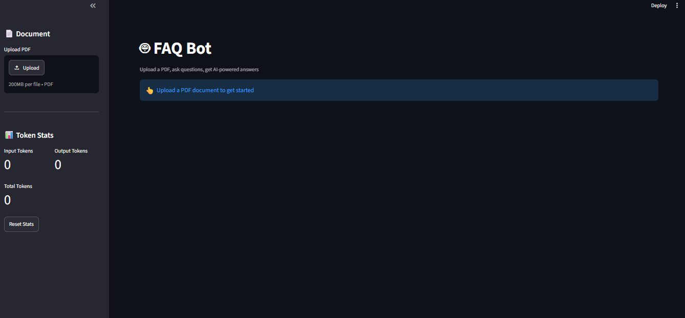

# 🤖 FAQ Bot with Streamlit

A **PDF-based FAQ Bot** built using **Streamlit, Google Gemini, ChromaDB, and RAG (Retrieval-Augmented Generation)**.

The application allows users to upload a PDF document, ask questions about the document, and receive AI-generated answers based only on the relevant information retrieved from the uploaded PDF.

## 📸 Project Screenshot



## 🚀 Features

* 📄 Upload PDF documents
* 🔍 Extract text from PDF files
* ✂️ Split documents into overlapping text chunks
* 🧠 Generate embeddings using Gemini
* 🗄️ Store document embeddings in ChromaDB
* 🔎 Retrieve relevant document chunks
* 🤖 Generate answers using Gemini
* 💬 Chat-style Streamlit interface
* 📊 Display input, output, and total token usage
* 📄 Show sources used for generating answers
* 🔄 Reset token statistics
* 💾 Maintain conversation history

## 🛠️ Technologies Used

* Python
* Streamlit
* Google Gemini API
* ChromaDB
* PyPDF2
* python-dotenv
* Retrieval-Augmented Generation (RAG)

## 📂 Project Structure

```text
FAQ_Bot/
│
├── app.py
├── requirements.txt
├── .gitignore
├── README.md
├── screenshots/
│   └── faq-bot.png
│
└── .venv/
```

> `.venv/` and `.env` should not be uploaded to GitHub.

## ⚙️ Installation and Setup

### 1. Clone the repository

```bash
git clone YOUR_GITHUB_REPOSITORY_URL
```

Move into the project folder:

```bash
cd FAQ_Bot
```

### 2. Create a virtual environment

```bash
python -m venv .venv
```

### 3. Activate the virtual environment

For Windows PowerShell:

```powershell
.\.venv\Scripts\Activate.ps1
```

For Windows Command Prompt:

```cmd
.venv\Scripts\activate
```

### 4. Install dependencies

```bash
pip install -r requirements.txt
```

Or:

```bash
pip install streamlit google-genai chromadb PyPDF2 python-dotenv
```

## 🔑 Configure Gemini API Key

Create a `.env` file in the project root:

```text
GEMINI_API_KEY=YOUR_GEMINI_API_KEY
```

The application reads the API key using `python-dotenv`.

**Do not upload the `.env` file to GitHub.**

## ▶️ Run the Application

After activating the virtual environment, run:

```bash
streamlit run app.py
```

The application will open in your browser at:

```text
http://localhost:8501
```

## 🔄 How the RAG System Works

```text
Upload PDF
    ↓
Extract PDF Text
    ↓
Split Text into Chunks
    ↓
Generate Gemini Embeddings
    ↓
Store Embeddings in ChromaDB
    ↓
User Asks a Question
    ↓
Generate Query Embedding
    ↓
Search Relevant Chunks
    ↓
Send Context + Question to Gemini
    ↓
Generate Answer
    ↓
Display Answer + Sources
```

## 💬 Example

### User Question

```text
What is the main purpose of this document?
```

### FAQ Bot

The application searches the uploaded PDF for relevant information and generates an answer using the retrieved document context.

## 📊 Token Statistics

The sidebar displays:

* **Input Tokens**
* **Output Tokens**
* **Total Tokens**

A **Reset Stats** button is also available to reset the token counters.

## 🔐 Security

The Gemini API key is stored in the `.env` file.

Example `.gitignore`:

```text
.venv/
.env
__pycache__/
*.pyc
```

Never commit your API key to GitHub.

## 📌 Future Improvements

* Support multiple PDF documents
* Add document management
* Improve chunking strategies
* Add conversation export
* Add PDF page references
* Add persistent ChromaDB storage
* Deploy the application online

## 👩‍💻 Author

**Shivani Patil**

### Skills Demonstrated

* Python
* Generative AI
* RAG
* Embeddings
* Vector Databases
* Streamlit
* Google Gemini API
* Document Processing

---

